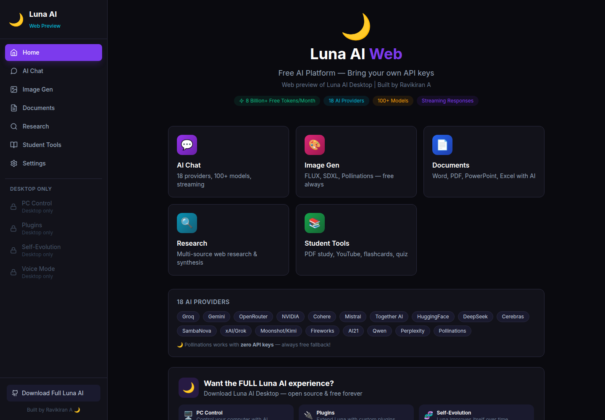
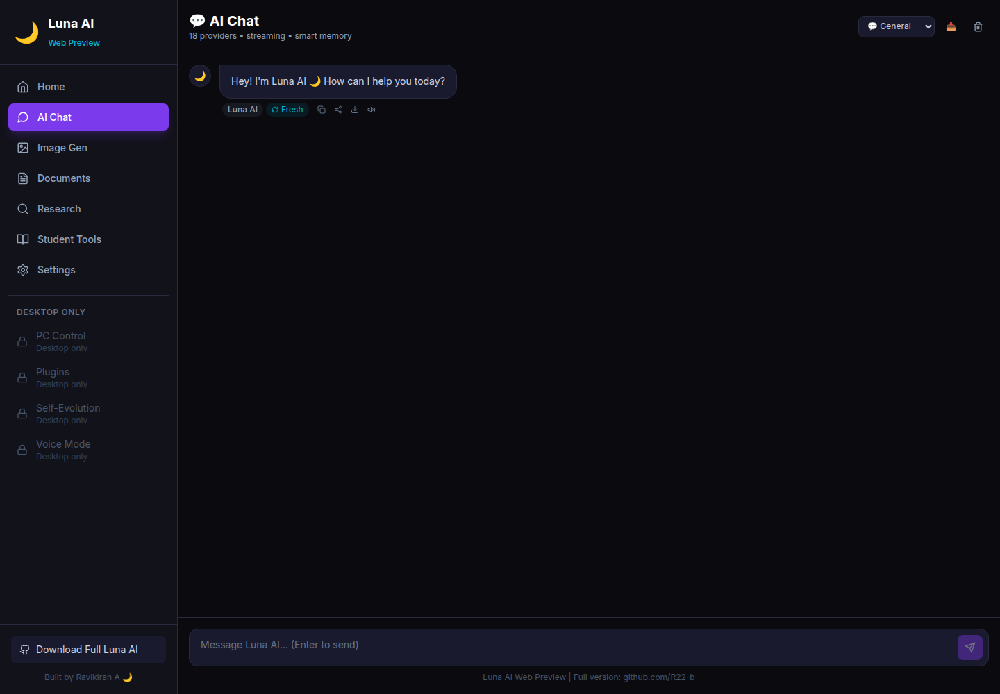
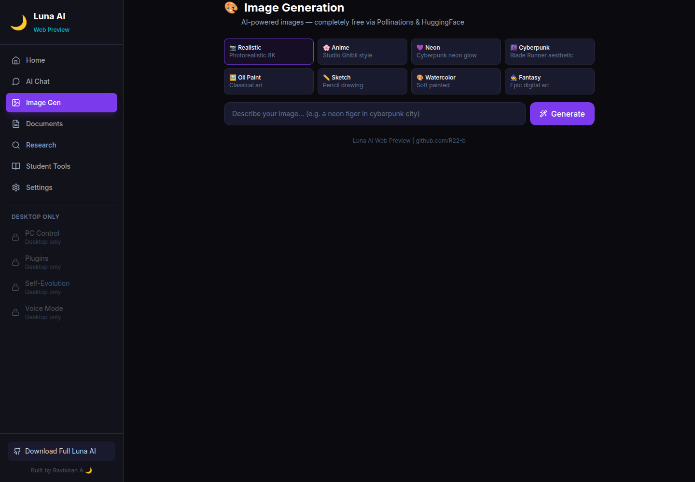
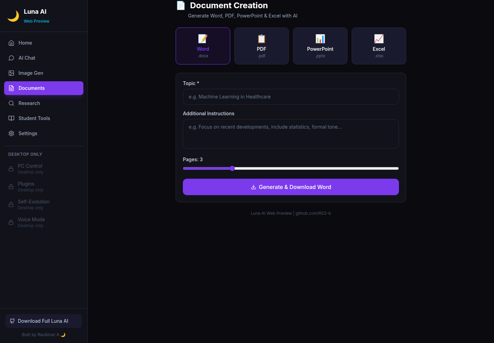
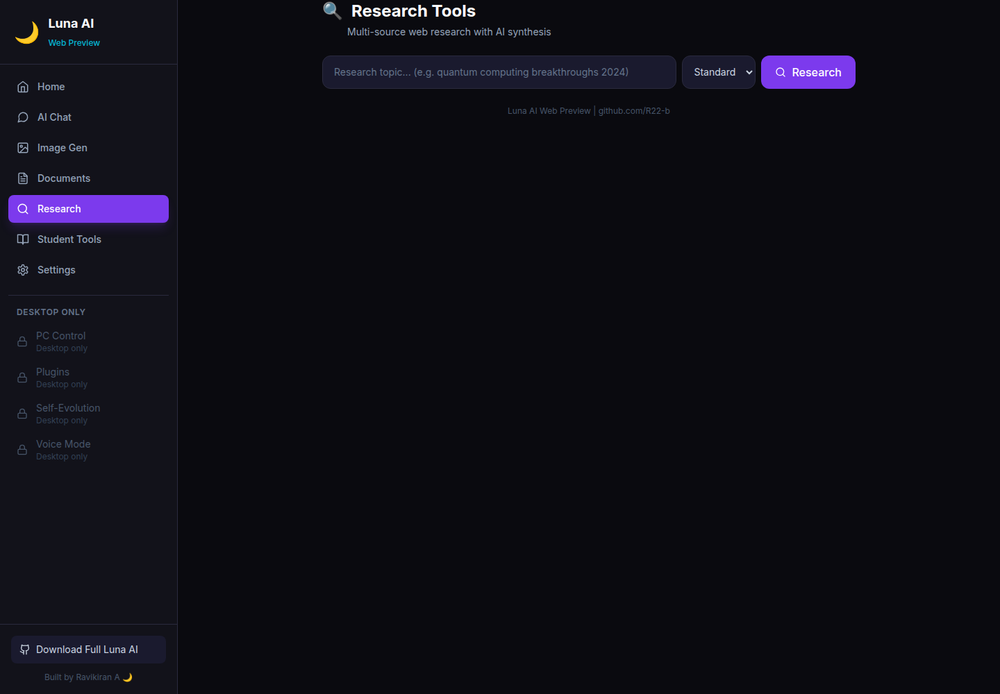
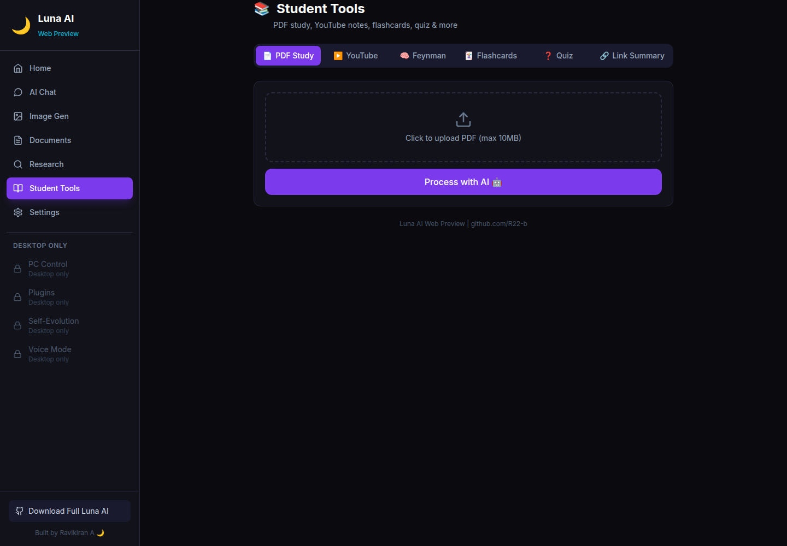
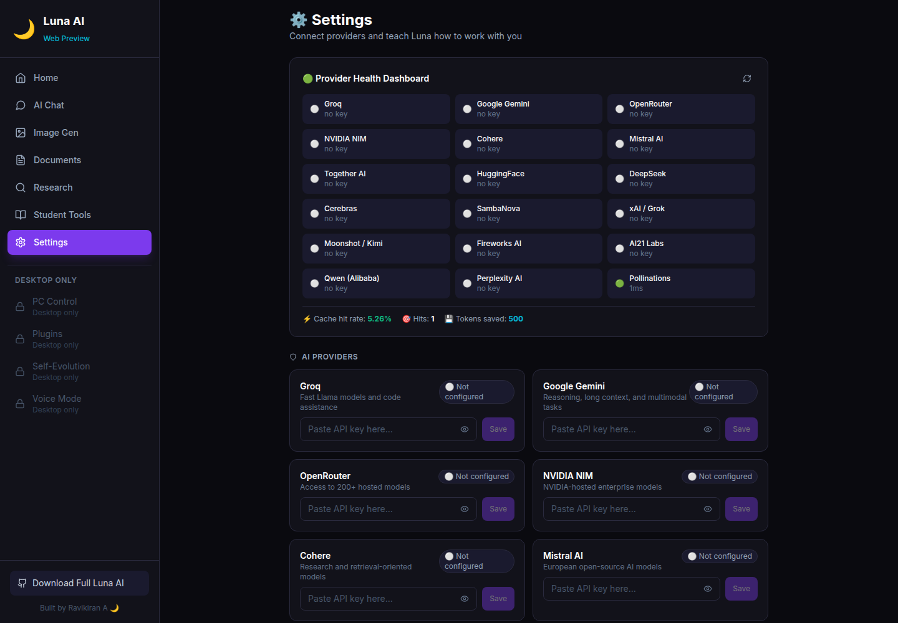

# Luna AI Web

<p align="center">
  
</p>

<p align="center">
  <strong>A browser-based AI workspace for chat, images, documents, research, and student tools.</strong><br />
  Built by <strong>Ravikiran A</strong> · <a href="https://github.com/R22-b">github.com/R22-b</a> · MIT License
</p>

Luna AI Web is the web preview of the Luna AI ecosystem. It provides a dark, responsive interface around an Express backend and a React/Vite frontend. The project is designed for a single-user or trusted local deployment, with optional API keys for multiple AI providers and a deterministic keyless demo fallback for development.

> **Project status:** Luna AI Web is available for testing and deployment. The original **Luna AI desktop application** is also present in Ravikiran’s GitHub ecosystem, but that project is still half completed. Its desktop-only capabilities are **coming soon** and will be announced separately when they are ready.

## Table of Contents

- [What Luna AI Web Includes](#what-luna-ai-web-includes)
- [Screenshots](#screenshots)
- [Project Architecture](#project-architecture)
- [Requirements](#requirements)
- [Start Luna AI Web Locally](#start-luna-ai-web-locally)
- [Using Luna AI Web](#using-luna-ai-web)
- [Getting API Keys](#getting-api-keys)
- [Configuring Keys in Settings](#configuring-keys-in-settings)
- [Deploying to Vercel](#deploying-to-vercel)
- [Backend Deployment](#backend-deployment)
- [API Reference](#api-reference)
- [Privacy and Security](#privacy-and-security)
- [Troubleshooting](#troubleshooting)
- [Original Luna AI Desktop: Coming Soon](#original-luna-ai-desktop-coming-soon)
- [Credits and License](#credits-and-license)

## What Luna AI Web Includes

| Area | Included functionality |
|---|---|
| AI Chat | Regular chat, task-type routing, streaming SSE responses, conversation history, context compression, caching, and routing logs. |
| AI Providers | Metadata and routing support for 18 providers: Groq, Gemini, OpenRouter, NVIDIA NIM, Cohere, Mistral, Together AI, Hugging Face, DeepSeek, Cerebras, SambaNova, xAI, Moonshot/Kimi, Fireworks AI, AI21 Labs, Qwen, Perplexity, and Pollinations. |
| Image Generation | Prompt-based image generation, eight styles, download support, cache support, and a local demo fallback when no image key is available. |
| Documents | Word, PDF, PowerPoint, and Excel generation with Luna AI branding. |
| Research | Search, source enrichment, summaries, and synthesized reports. Search uses configured providers when available and a fallback search path where supported. |
| Student Tools | PDF study assistance, YouTube notes, Feynman explanations, flashcards, quizzes, and link summaries. |
| Settings | Provider health dashboard, API-key management, masked key status, personality controls, profile settings, and session-data controls. |
| Responsive UI | Desktop sidebar, tablet layout, mobile hamburger menu, responsive feature pages, and accessible controls. |

## Screenshots

The screenshots below were captured from the working local application at 1440×1000 pixels. They show the seven primary routes included in the project.

### Home


### AI Chat



### Image Generation



### Documents



### Research



### Student Tools



### Settings



## Project Architecture

The repository contains two independently runnable applications:

```text
luna-ai-web/
├── README.md
├── .gitignore
├── backend/
│   ├── server.js
│   ├── .env.example
│   ├── model-registry.json
│   ├── middleware/
│   ├── routes/
│   └── services/
└── frontend/
    ├── index.html
    ├── vite.config.js
    ├── tailwind.config.js
    └── src/
        ├── App.jsx
        ├── components/
        ├── pages/
        ├── personality.js
        └── utils/api.js
```

The **frontend** is React 18 with Vite, TailwindCSS, React Router, Axios, Lucide icons, Framer Motion, and React Markdown. The **backend** is Node.js with Express and provides the API routes, provider routing, encrypted local key storage, caching, rate limiting, document generation, image handling, research, and student tools.

During local development, Vite proxies `/api` requests to `http://localhost:3001`. In a hosted deployment, the frontend must be configured to reach the public backend URL through `VITE_API_URL`, and the backend must allow the deployed frontend origin through `FRONTEND_URL`.

## Requirements

Install the following before starting:

| Requirement | Recommended version |
|---|---|
| Node.js | 18 or newer |
| npm | Included with Node.js |
| Git | Any current version |
| Browser | Current Chrome, Chromium, Edge, Firefox, or Safari |

A personal AI-provider key is optional for local testing. The application includes a deterministic local demo fallback when no provider key is configured. Provider keys are recommended for production-quality AI responses.

## Start Luna AI Web Locally

### 1. Clone the repository

```bash
git clone https://github.com/R22-b/luna-ai-web.git
cd luna-ai-web
```

### 2. Install and configure the backend

Open a terminal in the repository root and run:

```bash
cd backend
npm install
cp .env.example .env
```

Open `backend/.env` and add any provider keys you have. You may leave the keys empty for keyless demo mode. The important local values are:

```env
PORT=3001
FRONTEND_URL=http://localhost:5173
NODE_ENV=development
```

Start the backend:

```bash
node server.js
```

You should see a message similar to:

```text
🌙 Luna AI Web Backend running on port 3001
Health: http://localhost:3001/api/health
```

Check the backend in a browser or terminal:

```bash
curl http://localhost:3001/api/health
```

### 3. Install and start the frontend

Open a second terminal:

```bash
cd luna-ai-web/frontend
npm install
npm run dev
```

Open [http://localhost:5173](http://localhost:5173). The home page should display the Luna AI Web interface and the sidebar should contain Home, AI Chat, Image Gen, Documents, Research, Student Tools, and Settings.

### 4. Build the frontend for production

```bash
cd frontend
npm run build
```

The generated production files are written to `frontend/dist/`.

## Using Luna AI Web

### Home

The Home page introduces Luna AI Web, shows the supported provider ecosystem, links to the primary features, and describes the relationship between the web preview and the original Luna AI desktop application.

### AI Chat

Open **AI Chat**, enter a message, and press **Enter** or use the send control. Select a task mode when you want to influence routing. The available task modes include general chat, code, research, creative, and fast responses.

Responses can provide streaming text, provider information, cache status, and routing history. Depending on the browser and permissions, the response actions can copy, share, download, or read the answer aloud. The chat page also supports clearing the session and exporting the conversation as JSON.

The browser stores the session under `luna_chat_session`. The application keeps the most recent messages and can create a compressed summary after the configured message threshold. Clearing the chat removes the local session data.

### Image Generation

Open **Image Gen**, enter a prompt, choose one of the eight styles, and generate the image. The supported styles are:

| Style | Typical visual direction |
|---|---|
| Realistic | Photorealistic and highly detailed |
| Anime | Vibrant illustrated and cel-shaded |
| Neon | Neon-lit cyberpunk and synthwave |
| Cyberpunk | Futuristic city and rain-reflection aesthetic |
| Oil painting | Classical painted texture |
| Sketch | Pencil and graphite line work |
| Watercolor | Soft, flowing painted colors |
| Fantasy | Magical and epic digital-art direction |

Images can be downloaded from the result view. In keyless demo mode, the application returns a valid local demo image so the UI and download workflow remain testable.

### Documents

Open **Documents**, select Word, PDF, PowerPoint, or Excel, enter a topic and instructions, choose an approximate page count where applicable, and generate the file. Generated files are downloaded by the browser and include Luna AI attribution in their document content or metadata.

### Research

Open **Research**, enter a question, choose a depth, and select the requested number of sources. The research workflow searches for sources, summarizes available content, and produces a synthesized report. Search quality depends on the configured search provider, source availability, network connectivity, and the selected AI provider.

### Student Tools

Open **Student Tools** and choose the appropriate tab:

| Tool | Use |
|---|---|
| PDF | Upload and study a PDF within the configured size limit. |
| YouTube | Generate transcript-based notes when a transcript is available. |
| Feynman | Explain a topic in simple language with an analogy. |
| Flashcards | Create question-and-answer study cards. |
| Quiz | Create multiple-choice questions with answers and explanations. |
| Link Summary | Summarize the readable content of a web page. |

### Settings

Settings contains provider health, cache statistics, API-key slots, profile controls, personality controls, and session-data actions. API keys are shown only as configured or not configured, with the last four characters displayed for a saved key. Full key values are not returned to the frontend.

The identity fields in `frontend/src/personality.js` are locked to protect the project identity:

| Locked field | Required value |
|---|---|
| Name | Luna AI |
| Emoji | 🌙 |
| Creator | Ravikiran A |
| GitHub | github.com/R22-b |

Tone and the system prompt are intentionally changeable.

## Getting API Keys

API keys are optional in local demo mode. To improve response quality, create an account with a provider, generate a key from its official dashboard, and place it in Settings or in `backend/.env`. Never publish keys in source code, screenshots, README files, browser JavaScript, or public repositories.

| Provider or service | Environment variable | Key link |
|---|---|---|
| Groq | `GROQ_API_KEY` | [console.groq.com](https://console.groq.com) |
| Google Gemini | `GEMINI_API_KEY` | [aistudio.google.com](https://aistudio.google.com) |
| OpenRouter | `OPENROUTER_API_KEY` | [openrouter.ai](https://openrouter.ai) |
| NVIDIA NIM | `NVIDIA_API_KEY` | [build.nvidia.com](https://build.nvidia.com) |
| Cohere | `COHERE_API_KEY` | [dashboard.cohere.com](https://dashboard.cohere.com) |
| Mistral AI | `MISTRAL_API_KEY` | [console.mistral.ai](https://console.mistral.ai) |
| Together AI | `TOGETHER_API_KEY` | [api.together.xyz](https://api.together.xyz) |
| Hugging Face | `HF_API_KEY` | [huggingface.co/settings/tokens](https://huggingface.co/settings/tokens) |
| DeepSeek | `DEEPSEEK_API_KEY` | [platform.deepseek.com](https://platform.deepseek.com) |
| Cerebras | `CEREBRAS_API_KEY` | [cloud.cerebras.ai](https://cloud.cerebras.ai) |
| SambaNova | `SAMBANOVA_API_KEY` | [cloud.sambanova.ai](https://cloud.sambanova.ai) |
| xAI | `XAI_API_KEY` | [console.x.ai](https://console.x.ai) |
| Moonshot/Kimi | `MOONSHOT_API_KEY` | [platform.moonshot.cn](https://platform.moonshot.cn) |
| Fireworks AI | `FIREWORKS_API_KEY` | [fireworks.ai](https://fireworks.ai) |
| AI21 Labs | `AI21_API_KEY` | [studio.ai21.com](https://studio.ai21.com) |
| Qwen/DashScope | `QWEN_API_KEY` | [dashscope.aliyuncs.com](https://dashscope.aliyuncs.com) |
| Perplexity | `PERPLEXITY_API_KEY` | [perplexity.ai/settings/api](https://www.perplexity.ai/settings/api) |
| Leonardo AI | `LEONARDO_API_KEY` | [app.leonardo.ai](https://app.leonardo.ai) |
| Serper | `SERPER_API_KEY` | [serper.dev](https://serper.dev) |
| Brave Search | `BRAVE_API_KEY` | [brave.com/search/api](https://brave.com/search/api) |

The project also includes Pollinations support. The public endpoint may require authentication or may be unavailable, so the application uses a local deterministic fallback when no usable remote provider is available.

### Add a key through `.env`

```env
GROQ_API_KEY=your_key_here
GEMINI_API_KEY=your_key_here
SERPER_API_KEY=your_key_here
```

Restart the backend after changing `.env`.

### Add a key through Settings

1. Open **Settings**.
2. Find the provider card.
3. Paste the key into the password field.
4. Save the key.
5. Use the connection test when available.
6. Confirm that the provider shows as configured and that only the masked last four characters are displayed.

The backend stores saved keys in `backend/.luna-data/`, which is ignored by Git. Do not delete the ignore rule or commit this directory.

## Deploying to Vercel

The frontend is Vercel-friendly because it is a Vite application. The backend is a long-running Express server and should be deployed as a separate service unless it is deliberately converted into Vercel serverless functions. The simplest reliable deployment is therefore:

> **Vercel for the frontend + a Node-compatible host for the backend.**

### Deploy the frontend to Vercel

1. Sign in to [Vercel](https://vercel.com).
2. Import the GitHub repository `R22-b/luna-ai-web`.
3. Set the **Root Directory** to `frontend`.
4. Use `npm install` for installation.
5. Use `npm run build` as the build command.
6. Set the output directory to `dist`.
7. Add the environment variable `VITE_API_URL` with the public URL of your deployed backend, for example:

```text
VITE_API_URL=https://your-luna-backend.example.com/api
```

8. Deploy the project.

The frontend uses `VITE_API_URL` for all API calls when it is set, and falls back to `/api` for local development through the Vite proxy. Set `VITE_API_URL` to the complete backend API base ending in `/api`, for example `https://your-luna-backend.example.com/api`.

### Configure the backend for the Vercel frontend

On the backend host, set:

```env
PORT=3001
FRONTEND_URL=https://your-vercel-project.vercel.app
NODE_ENV=production
```

If you use a custom domain, use that domain instead. Configure provider keys as secrets in the backend host’s environment-variable panel, not in the GitHub repository.

### Important Vercel limitation

Do not assume that deploying only the `frontend` directory also deploys `backend/server.js`. The Vercel frontend deployment serves the React interface, while the Express API must be reachable at the configured backend URL. If the backend is not deployed, the interface can load but chat, image, document, research, student, and settings API requests will fail.

## Backend Deployment

Use a Node-compatible host that supports a persistent Express process, such as Render, Railway, Fly.io, or another managed Node service. The exact provider configuration varies, but the application needs:

```bash
cd backend
npm install
node server.js
```

The service must expose the configured port, provide the environment variables from `.env.example`, allow CORS requests from the Vercel frontend, and preserve the backend’s writable local data directory if encrypted settings storage is enabled. For a public multi-user service, replace the local settings store with authenticated, per-user secret storage before accepting user keys.

## API Reference

| Method | Route | Purpose |
|---|---|---|
| GET | `/api/health` | Backend status, version, creator, uptime, and cache statistics. |
| POST | `/api/chat` | Regular chat with task routing and caching. |
| GET | `/api/chat/stream` | Server-Sent Events streaming chat. |
| GET | `/api/chat/health` | Health and metadata for all 18 providers plus cache statistics. |
| GET | `/api/chat/models` | Available configured provider models. |
| POST | `/api/image/generate` | Generate an image from a prompt and style. |
| GET | `/api/image/styles` | List supported image styles. |
| POST | `/api/documents/generate` | Generate Word, PDF, PowerPoint, or Excel files. |
| POST | `/api/research` | Search, summarize, and synthesize a research report. |
| POST | `/api/student/pdf` | Analyze an uploaded PDF. |
| POST | `/api/student/youtube` | Process a YouTube transcript when available. |
| POST | `/api/student/feynman` | Explain a topic using the Feynman technique. |
| POST | `/api/student/flashcards` | Generate flashcards. |
| POST | `/api/student/quiz` | Generate multiple-choice questions. |
| POST | `/api/student/link` | Summarize a web page. |
| GET | `/api/settings/keys` | Return safe key metadata and masked state. |
| POST | `/api/settings/keys` | Save or clear provider keys. |
| POST | `/api/settings/test` | Test a provider connection. |
| GET | `/api/settings/profile` | Read the local profile. |
| POST | `/api/settings/profile` | Save the local profile. |

### Example health check

```bash
curl http://localhost:3001/api/health
```

### Example chat request

```bash
curl -X POST http://localhost:3001/api/chat \
  -H "Content-Type: application/json" \
  -d '{
    "message": "Explain machine learning simply",
    "history": [],
    "taskType": "chat"
  }'
```

## Privacy and Security

Luna AI Web is a preview intended for a single user or a trusted environment. The current Settings API does not provide authentication or per-user isolation. Before operating a public multi-user deployment, add authentication, per-user storage, HTTPS, request auditing without secret values, settings-write rate limiting, and a proper secret-management system.

Provider keys are sensitive credentials. Do not place them in frontend code, commit them to Git, paste them into issue reports, or include them in screenshots. If a key is exposed, revoke it at the provider dashboard and create a replacement.

The profile feature is optional. Do not store passwords, financial information, private access tokens, or other highly sensitive information in the profile. Only enable provider profile sharing when you understand that profile context may be sent to an AI provider as part of a request.

## Troubleshooting

| Problem | What to check |
|---|---|
| Frontend opens but requests fail | Confirm the backend is running on port 3001 locally, or confirm `VITE_API_URL` points to the deployed backend URL. |
| CORS error after deployment | Set backend `FRONTEND_URL` to the exact Vercel origin, including the correct protocol and custom domain. |
| Chat says all providers failed | Add at least one valid provider key, or confirm that the keyless local fallback is enabled and the backend is using the latest project files. |
| Images are slow or unavailable | Public image services can require authentication or have rate limits. Configure a supported image provider or use the local demo fallback for UI testing. |
| Documents fail | Check backend dependencies, writable temporary storage, request size, and provider availability. PDF output uses standard fonts and may replace unsupported Unicode glyphs. |
| YouTube tool returns no transcript | Some videos disable transcripts. Try another video. |
| PDF upload fails | Keep the file within the configured request limit and use a readable PDF. |
| Saved key does not appear | Restart the backend only when using `.env`; keys saved from Settings are stored under `backend/.luna-data/`. |
| Mobile menu is not visible | Resize the browser below the responsive breakpoint or use a mobile device. |

## Original Luna AI Desktop: Coming Soon

Luna AI Web is the browser preview. The original Luna AI desktop project is a separate project in the GitHub ecosystem and is intended to provide desktop-only capabilities such as PC control, plugins, voice mode, Project Guardian, and self-evolution. That original project is currently **half completed**.

The desktop version is **coming soon**. Luna AI Web is being shared first so users can explore the web experience, test the AI workspace, and provide feedback while the full desktop application continues development.

Follow [R22-b on GitHub](https://github.com/R22-b) for future updates and announcements.

## Credits and License

Luna AI Web was built by **Ravikiran A** and is **MIT licensed**. This is an open-source project: you may use, copy, modify, merge, publish, distribute, sublicense, and sell copies of the software, subject to the terms of the MIT License. The complete license text should be included in a `LICENSE` file in the repository. The Luna identity used by the application is:

> **Luna AI 🌙 — Built by Ravikiran A · github.com/R22-b**

### MIT License Summary

Copyright (c) Ravikiran A

Permission is hereby granted, free of charge, to any person obtaining a copy of this software and associated documentation files, to use the software without restriction, including without limitation the rights to use, copy, modify, merge, publish, distribute, sublicense, and sell copies, subject to the conditions of the MIT License. The software is provided “as is”, without warranty of any kind. See the official [MIT License text](https://opensource.org/license/mit) for the full terms.

## References

[1]: https://gen.pollinations.ai/docs "Pollinations API Documentation"
[2]: https://pollinations.ai/play "Pollinations API Playground"
